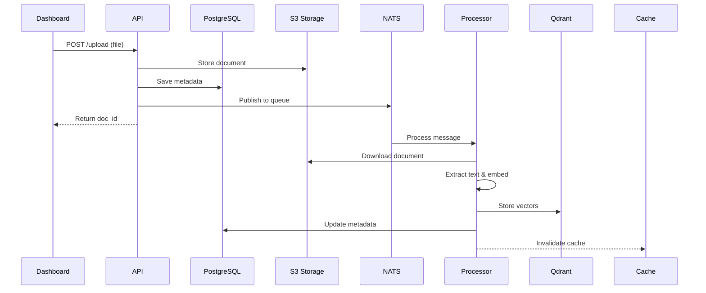
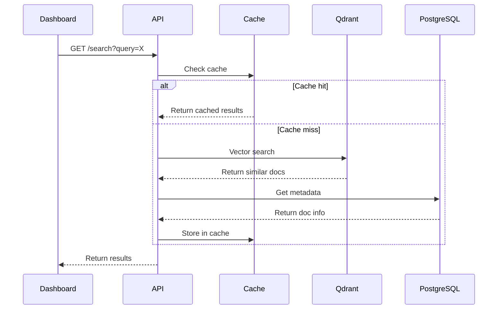

# ESG Legal Compliance RAG - Hello World PRD

**Version**: 2.0
**Date**: July 2025
**Status**: Final Draft

---

## 1. Executive Summary

### 1.1 Purpose
This document defines a minimal viable demonstration ("Hello World") of an ESG Legal Compliance RAG (Retrieval-Augmented Generation) system deployed on Zerops infrastructure. The system demonstrates core functionality with each service performing the bare minimum to showcase its role in the architecture.

### 1.2 Objectives
- **Demonstrate** end-to-end document processing and querying
- **Validate** service interconnectivity on Zerops
- **Establish** foundation for future development
- **Minimize** complexity while maintaining architectural integrity

### 1.3 Scope
- ✅ Basic document upload and embedding
- ✅ Simple vector search functionality
- ✅ Minimal queue-based processing
- ✅ Basic web dashboard
- ✅ PostgreSQL for metadata
- ✅ Valkey for caching
- ❌ Authentication/authorization
- ❌ Advanced compliance features
- ❌ Production optimizations

---

## 2. System Architecture

### 2.1 Service Overview

```yaml
project: esg-rag-hello-world
corePackage: LIGHTWEIGHT  # Minimal resources for demo

services:
  # API Service - Python FastAPI
  - hostname: api
    type: python@3.11
    minContainers: 1
    maxContainers: 1

  # Document Processor - Python Worker
  - hostname: processor
    type: python@3.11
    minContainers: 1
    maxContainers: 1

  # PostgreSQL for metadata
  - hostname: db
    type: postgresql@16
    mode: NON_HA  # Single container for demo

  # Valkey for caching
  - hostname: cache
    type: valkey@7.2
    mode: NON_HA

  # Vector Database - Qdrant (native service)
  - hostname: qdrant
    type: qdrant@1.12
    mode: NON_HA

  # Message Queue - NATS (native service)
  - hostname: queue
    type: nats@2
    mode: NON_HA

  # Object Storage
  - hostname: storage
    type: object-storage
    objectStorageSize: 2
    objectStoragePolicy: public-read
    priority: 10

  # Dashboard - Static site with Alpine.js
  - hostname: dashboard
    type: static
```

### 2.2 Architecture Diagram

```
┌─────────────┐     ┌─────────────┐     ┌─────────────┐     ┌─────────────┐
│  Dashboard  │────▶│     API     │────▶│   Qdrant    │     │ PostgreSQL  │
│ (Alpine.js) │     │  (FastAPI)  │     │  (Vectors)  │     │ (Metadata)  │
└─────────────┘     └──────┬──────┘     └─────────────┘     └─────────────┘
                           │
                           ▼
                    ┌─────────────┐     ┌─────────────┐     ┌─────────────┐
                    │    NATS     │────▶│  Processor  │     │   Valkey    │
                    │   (Queue)   │     │  (Worker)   │     │   (Cache)   │
                    └─────────────┘     └──────┬──────┘     └─────────────┘
                                              │
                                              ▼
                                       ┌─────────────┐
                                       │   Storage   │
                                       │     (S3)    │
                                       └─────────────┘
```

---

## 3. Functional Requirements

### 3.1 API Service

**Purpose**: Provide REST endpoints for document operations and queries

**Endpoints**:

| Method | Path | Description | Demo Functionality |
|--------|------|-------------|-------------------|
| POST | `/upload` | Upload document | Accept PDF/TXT, store in S3, save metadata to PostgreSQL, queue for processing |
| GET | `/search` | Vector search | Check cache first, query Qdrant if needed, return top 3 results |
| GET | `/status` | System status | Return service connectivity status |
| GET | `/documents` | List documents | Query PostgreSQL for document metadata |

**Hello World Implementation**:
```python
# main.py
from fastapi import FastAPI, UploadFile, File
from fastapi.middleware.cors import CORSMiddleware
import asyncpg
import httpx
import nats
import boto3
import redis
import uuid
import json
import os
from datetime import datetime

app = FastAPI(title="ESG RAG Hello World")

# Enable CORS for dashboard
app.add_middleware(
    CORSMiddleware,
    allow_origins=["*"],
    allow_methods=["*"],
    allow_headers=["*"],
)

# Service connections
s3 = None
nc = None
db_pool = None
redis_client = None

@app.on_event("startup")
async def startup():
    global nc, db_pool, s3, redis_client

    # NATS connection (no auth needed)
    nc = await nats.connect(os.getenv("NATS_URL"))

    # PostgreSQL connection
    db_pool = await asyncpg.create_pool(
        host=os.getenv("DB_HOST"),
        port=int(os.getenv("DB_PORT", 5432)),
        database=os.getenv("DB_NAME"),
        user=os.getenv("DB_USER"),
        password=os.getenv("DB_PASSWORD")
    )

    # S3 client
    s3 = boto3.client(
        's3',
        endpoint_url=os.getenv("AWS_ENDPOINT"),
        aws_access_key_id=os.getenv("AWS_ACCESS_KEY_ID"),
        aws_secret_access_key=os.getenv("AWS_SECRET_ACCESS_KEY"),
        use_ssl=True,
        region_name=os.getenv("AWS_REGION", "us-east-1")
    )

    # Redis client (no auth needed)
    redis_client = redis.Redis(
        host=os.getenv("REDIS_HOST"),
        port=6379,
        decode_responses=True
    )

    # Initialize database schema
    async with db_pool.acquire() as conn:
        await conn.execute("""
            CREATE TABLE IF NOT EXISTS documents (
                id UUID PRIMARY KEY,
                filename VARCHAR(255),
                upload_date TIMESTAMP DEFAULT CURRENT_TIMESTAMP,
                processed BOOLEAN DEFAULT FALSE,
                text_preview TEXT
            )
        """)

@app.post("/upload")
async def upload_document(file: UploadFile = File(...)):
    # Generate unique ID
    doc_id = str(uuid.uuid4())

    # Save to S3
    s3.put_object(
        Bucket=os.getenv("AWS_BUCKET"),
        Key=f"documents/{doc_id}.pdf",
        Body=await file.read()
    )

    # Save metadata to PostgreSQL
    async with db_pool.acquire() as conn:
        await conn.execute("""
            INSERT INTO documents (id, filename)
            VALUES ($1, $2)
        """, doc_id, file.filename)

    # Queue for processing
    await nc.publish("document.process", json.dumps({
        "id": doc_id,
        "filename": file.filename
    }).encode())

    return {"id": doc_id, "status": "queued"}

@app.get("/search")
async def search(query: str):
    # Check cache first
    cache_key = f"search:{query}"
    cached = redis_client.get(cache_key)

    if cached:
        return json.loads(cached)

    # Call Qdrant for vector search
    async with httpx.AsyncClient() as client:
        response = await client.post(
            f"{os.getenv('QDRANT_URL')}/collections/documents/points/search",
            headers={
                "api-key": os.getenv("QDRANT_API_KEY")
            },
            json={
                "vector": [0.1] * 384,  # Dummy vector for demo
                "limit": 3,
                "with_payload": True
            }
        )

    result = {
        "query": query,
        "results": response.json().get("result", [])
    }

    # Cache for 5 minutes
    redis_client.setex(cache_key, 300, json.dumps(result))

    return result

@app.get("/documents")
async def list_documents():
    async with db_pool.acquire() as conn:
        rows = await conn.fetch("""
            SELECT id, filename, upload_date, processed
            FROM documents
            ORDER BY upload_date DESC
            LIMIT 10
        """)

    return [dict(row) for row in rows]

@app.get("/status")
async def status():
    services = {}

    # Check NATS
    services['nats'] = 'connected' if nc and nc.is_connected else 'disconnected'

    # Check PostgreSQL
    try:
        async with db_pool.acquire() as conn:
            await conn.fetchval("SELECT 1")
        services['postgresql'] = 'healthy'
    except:
        services['postgresql'] = 'unhealthy'

    # Check Qdrant
    try:
        async with httpx.AsyncClient() as client:
            await client.get(
                f"{os.getenv('QDRANT_URL')}/health",
                headers={"api-key": os.getenv("QDRANT_API_KEY")},
                timeout=2
            )
        services['qdrant'] = 'healthy'
    except:
        services['qdrant'] = 'unhealthy'

    # Check S3
    try:
        s3.list_buckets()
        services['storage'] = 'healthy'
    except:
        services['storage'] = 'unhealthy'

    # Check Redis
    try:
        redis_client.ping()
        services['cache'] = 'healthy'
    except:
        services['cache'] = 'unhealthy'

    return {"status": "operational", "services": services}
```

### 3.2 Document Processor

**Purpose**: Process documents from queue and create embeddings

**Functionality**:
- Listen to NATS queue
- Download document from S3
- Extract text (basic extraction only)
- Create embeddings (use small model)
- Store in Qdrant
- Update PostgreSQL metadata

**Hello World Implementation**:
```python
# processor.py
import asyncio
import asyncpg
import nats
import json
import boto3
import httpx
import os
from sentence_transformers import SentenceTransformer

# Initialize services
s3 = boto3.client(
    's3',
    endpoint_url=os.getenv("AWS_ENDPOINT"),
    aws_access_key_id=os.getenv("AWS_ACCESS_KEY_ID"),
    aws_secret_access_key=os.getenv("AWS_SECRET_ACCESS_KEY"),
    use_ssl=True,
    region_name=os.getenv("AWS_REGION", "us-east-1")
)

model = SentenceTransformer('all-MiniLM-L6-v2')  # Small, fast model

async def process_document(msg):
    data = json.loads(msg.data.decode())
    doc_id = data['id']

    print(f"Processing document {doc_id}")

    # Connect to PostgreSQL
    conn = await asyncpg.connect(
        host=os.getenv("DB_HOST"),
        port=int(os.getenv("DB_PORT", 5432)),
        database=os.getenv("DB_NAME"),
        user=os.getenv("DB_USER"),
        password=os.getenv("DB_PASSWORD")
    )

    try:
        # Download from S3
        obj = s3.get_object(
            Bucket=os.getenv("AWS_BUCKET"),
            Key=f"documents/{doc_id}.pdf"
        )
        content = obj['Body'].read()

        # Extract text (simplified - just use first 500 chars for demo)
        text = content.decode('utf-8', errors='ignore')[:500]

        # Create embedding
        embedding = model.encode(text).tolist()

        # Store in Qdrant
        async with httpx.AsyncClient() as client:
            await client.put(
                f"{os.getenv('QDRANT_URL')}/collections/documents/points",
                headers={
                    "api-key": os.getenv("QDRANT_API_KEY")
                },
                json={
                    "points": [{
                        "id": doc_id,
                        "vector": embedding,
                        "payload": {
                            "text": text,
                            "filename": data['filename'],
                            "doc_id": doc_id
                        }
                    }]
                }
            )

        # Update PostgreSQL
        await conn.execute("""
            UPDATE documents
            SET processed = true, text_preview = $1
            WHERE id = $2
        """, text[:200], doc_id)

        print(f"Processed document {doc_id}")

    finally:
        await conn.close()

async def main():
    nc = await nats.connect(os.getenv("NATS_URL"))

    # Subscribe to processing queue
    sub = await nc.subscribe("document.process", cb=process_document)

    print("Processor started, waiting for documents...")

    # Keep running
    await asyncio.Event().wait()

if __name__ == "__main__":
    asyncio.run(main())
```

### 3.3 Qdrant Service

**Purpose**: Vector database for document embeddings (native Zerops service)

**Configuration**: Automatically handled by Zerops

**Collection Initialization**: Handled automatically by API service on startup (see Section 4.1)

### 3.4 Authentication Notes

Based on Zerops native services configuration:
- **Qdrant**: Requires API key authentication (provided as `${qdrant_apiKey}`)
- **NATS**: No authentication needed for internal use
- **Valkey (Redis)**: No authentication needed for internal use
- **PostgreSQL**: Uses standard user/password authentication
- **Object Storage**: Uses AWS-compatible access keys

### 3.4 Dashboard

**Purpose**: Simple web interface for upload and search

**Technology**: HTML + Alpine.js (no build step)

**Features**:
- Upload form
- Search box
- Results display
- Document list
- Service status indicator

**Implementation**:
```html
<!-- index.html -->
<!DOCTYPE html>
<html lang="en">
<head>
    <meta charset="UTF-8">
    <meta name="viewport" content="width=device-width, initial-scale=1.0">
    <title>ESG RAG Hello World</title>
    <script src="https://unpkg.com/alpinejs@3.x.x/dist/cdn.min.js" defer></script>
    <script src="https://cdn.tailwindcss.com"></script>
</head>
<body class="bg-gray-50">
    <div x-data="app()" class="max-w-6xl mx-auto p-6">
        <h1 class="text-3xl font-bold mb-8">🌱 ESG RAG Hello World</h1>

        <!-- Status Section -->
        <div class="bg-white rounded-lg shadow p-6 mb-6">
            <h2 class="text-xl font-semibold mb-4">System Status</h2>
            <div x-show="!status" class="text-gray-500">Loading...</div>
            <div x-show="status" class="grid grid-cols-3 gap-4">
                <template x-for="[service, state] in Object.entries(status.services || {})">
                    <div class="flex items-center">
                        <span class="w-3 h-3 rounded-full mr-2"
                              :class="(state === 'healthy' || state === 'connected') ? 'bg-green-500' : 'bg-red-500'"></span>
                        <span x-text="service + ': ' + state" class="text-sm"></span>
                    </div>
                </template>
            </div>
        </div>

        <div class="grid md:grid-cols-2 gap-6">
            <!-- Upload Section -->
            <div class="bg-white rounded-lg shadow p-6">
                <h2 class="text-xl font-semibold mb-4">Upload Document</h2>
                <input type="file" @change="selectedFile = $event.target.files[0]"
                       accept=".txt,.pdf" class="mb-4 text-sm">
                <button @click="upload()" :disabled="!selectedFile"
                        class="bg-blue-500 text-white px-4 py-2 rounded disabled:opacity-50">
                    Upload
                </button>
                <div x-show="uploadStatus" x-text="uploadStatus"
                     class="mt-3 text-sm" :class="uploadStatus.includes('failed') ? 'text-red-600' : 'text-green-600'"></div>
            </div>

            <!-- Search Section -->
            <div class="bg-white rounded-lg shadow p-6">
                <h2 class="text-xl font-semibold mb-4">Search Documents</h2>
                <div class="flex gap-2">
                    <input type="text" x-model="searchQuery"
                           placeholder="Enter search query..."
                           class="flex-1 px-3 py-2 border rounded">
                    <button @click="search()"
                            class="bg-green-500 text-white px-4 py-2 rounded">
                        Search
                    </button>
                </div>

                <div x-show="searchStatus" x-text="searchStatus"
                     class="mt-2 text-sm text-gray-500"></div>
            </div>
        </div>

        <!-- Documents List -->
        <div class="bg-white rounded-lg shadow p-6 mt-6">
            <h2 class="text-xl font-semibold mb-4">Recent Documents</h2>
            <div x-show="documents.length === 0" class="text-gray-500">No documents uploaded yet</div>
            <div x-show="documents.length > 0" class="space-y-2">
                <template x-for="doc in documents">
                    <div class="flex justify-between items-center p-3 bg-gray-50 rounded">
                        <span x-text="doc.filename" class="font-medium"></span>
                        <span x-text="doc.processed ? 'Processed' : 'Processing...'"
                              class="text-sm" :class="doc.processed ? 'text-green-600' : 'text-yellow-600'"></span>
                    </div>
                </template>
            </div>
        </div>

        <!-- Search Results -->
        <div x-show="results.length > 0" class="bg-white rounded-lg shadow p-6 mt-6">
            <h3 class="text-xl font-semibold mb-4">Search Results</h3>
            <template x-for="result in results">
                <div class="mb-4 p-4 bg-gray-50 rounded">
                    <strong x-text="result.payload?.filename || 'Unknown'" class="block mb-2"></strong>
                    <p x-text="result.payload?.text || 'No preview'" class="text-sm text-gray-700"></p>
                    <small class="text-gray-500">Score: <span x-text="result.score?.toFixed(3)"></span></small>
                </div>
            </template>
        </div>
    </div>

    <script>
        function app() {
            return {
                status: null,
                selectedFile: null,
                uploadStatus: '',
                searchQuery: '',
                searchStatus: '',
                results: [],
                documents: [],

                async init() {
                    await this.checkStatus();
                    await this.loadDocuments();
                    // Auto-refresh
                    setInterval(() => {
                        this.checkStatus();
                        this.loadDocuments();
                    }, 5000);
                },

                async checkStatus() {
                    try {
                        const response = await fetch('http://api:8000/status');
                        this.status = await response.json();
                    } catch (error) {
                        this.status = { services: { api: 'unreachable' } };
                    }
                },

                async loadDocuments() {
                    try {
                        const response = await fetch('http://api:8000/documents');
                        this.documents = await response.json();
                    } catch (error) {
                        console.error('Failed to load documents:', error);
                    }
                },

                async upload() {
                    if (!this.selectedFile) return;

                    const formData = new FormData();
                    formData.append('file', this.selectedFile);

                    try {
                        this.uploadStatus = 'Uploading...';
                        const response = await fetch('http://api:8000/upload', {
                            method: 'POST',
                            body: formData
                        });
                        const result = await response.json();
                        this.uploadStatus = `Uploaded! ID: ${result.id}`;
                        this.selectedFile = null;
                        // Refresh documents
                        setTimeout(() => this.loadDocuments(), 1000);
                    } catch (error) {
                        this.uploadStatus = 'Upload failed: ' + error.message;
                    }
                },

                async search() {
                    if (!this.searchQuery) return;

                    try {
                        this.searchStatus = 'Searching...';
                        const response = await fetch(`http://api:8000/search?query=${encodeURIComponent(this.searchQuery)}`);
                        const data = await response.json();
                        this.results = data.results || [];
                        this.searchStatus = `Found ${this.results.length} results`;
                    } catch (error) {
                        this.searchStatus = 'Search failed';
                        this.results = [];
                    }
                }
            }
        }
    </script>
</body>
</html>
```

---

## 4. Technical Specifications

### 4.1 Zerops Configuration

```yaml
# zerops.yml
zerops:
  # API Service
  - setup: api
    build:
      deploy: ./api
      addToRunPrepare:
        - requirements.txt
    run:
      base: python@3.11
      ports:
        - port: 8000
          httpSupport: true
      prepareCommands:
        - uv pip install --system -r requirements.txt
      initCommands:
        - |
          zsc execOnce qdrant-init -- curl -X PUT \
            "${QDRANT_URL}/collections/documents" \
            -H "api-key: ${QDRANT_API_KEY}" \
            -H "Content-Type: application/json" \
            -d '{
              "vectors": {
                "size": 384,
                "distance": "Cosine"
              }
            }'
      start: gunicorn main:app --bind 0.0.0.0:8000 --workers ${WORKERS:-1} --worker-class uvicorn.workers.UvicornWorker
      envVariables:
        WORKERS: 2
        # PostgreSQL connection
        DB_HOST: ${db_host}
        DB_PORT: ${db_port}
        DB_NAME: ${db_database}
        DB_USER: ${db_user}
        DB_PASSWORD: ${db_password}
        # Object Storage
        AWS_ACCESS_KEY_ID: ${storage_accessKeyId}
        AWS_REGION: us-east-1
        AWS_BUCKET: ${storage_bucketName}
        AWS_ENDPOINT: ${storage_apiUrl}
        AWS_SECRET_ACCESS_KEY: ${storage_secretAccessKey}
        AWS_URL: ${storage_apiUrl}/${storage_bucketName}
        AWS_USE_PATH_STYLE_ENDPOINT: true
        # NATS (no auth needed)
        NATS_URL: nats://${queue_hostname}:4222
        # Qdrant
        QDRANT_URL: ${qdrant_connectionString}
        QDRANT_API_KEY: ${qdrant_apiKey}
        # Valkey/Redis (no auth needed)
        REDIS_HOST: ${cache_hostname}
        REDIS_PORT: 6379

  # Document Processor
  - setup: processor
    build:
      deploy: ./processor
      addToRunPrepare:
        - requirements.txt
    run:
      base: python@3.11
      prepareCommands:
        - uv pip install --system -r requirements.txt
      start: python processor.py
      envVariables:
        # PostgreSQL connection
        DB_HOST: ${db_host}
        DB_PORT: ${db_port}
        DB_NAME: ${db_database}
        DB_USER: ${db_user}
        DB_PASSWORD: ${db_password}
        # Object Storage
        AWS_ACCESS_KEY_ID: ${storage_accessKeyId}
        AWS_REGION: us-east-1
        AWS_BUCKET: ${storage_bucketName}
        AWS_ENDPOINT: ${storage_apiUrl}
        AWS_SECRET_ACCESS_KEY: ${storage_secretAccessKey}
        AWS_URL: ${storage_apiUrl}/${storage_bucketName}
        AWS_USE_PATH_STYLE_ENDPOINT: true
        # NATS
        NATS_HOST: ${queue_host}
        NATS_PORT: ${queue_port}
        # Qdrant
        QDRANT_HOST: ${qdrant_host}
        QDRANT_PORT: ${qdrant_port}

  # Dashboard
  - setup: dashboard
    build:
      deploy: ./dashboard
      deployFiles:
        - index.html
```

### 4.2 Database Services Configuration

The following services are configured through Zerops GUI or import YAML:

```yaml
services:
  # PostgreSQL Database
  - hostname: db
    type: postgresql@16
    mode: NON_HA

  # Valkey Cache
  - hostname: cache
    type: valkey@7.2
    mode: NON_HA

  # NATS Message Queue
  - hostname: queue
    type: nats@2
    mode: NON_HA

  # Qdrant Vector Database
  - hostname: qdrant
    type: qdrant@1.12
    mode: NON_HA

  # Object Storage
  - hostname: storage
    type: object-storage
    objectStorageSize: 2
    objectStoragePolicy: public-read
    priority: 10
```

### 4.3 Python Dependencies

**API requirements.txt**:
```
fastapi==0.104.1
uvicorn[standard]==0.24.0
gunicorn==21.2.0
asyncpg==0.29.0
httpx==0.25.2
nats-py==2.6.0
boto3==1.29.7
redis==5.0.1
python-multipart==0.0.6
```

**Processor requirements.txt**:
```
asyncpg==0.29.0
nats-py==2.6.0
boto3==1.29.7
httpx==0.25.2
sentence-transformers==2.2.2
torch==2.1.0
```

### 4.4 Resource Allocation

| Service | CPU | RAM | Disk | Notes |
|---------|-----|-----|------|-------|
| api | 0.5 cores | 512 MB | 1 GB | Minimal for demo |
| processor | 1 core | 1 GB | 2 GB | Model loading |
| db | 0.5 cores | 512 MB | 10 GB | PostgreSQL |
| cache | 0.25 cores | 256 MB | - | Valkey in-memory |
| qdrant | 0.5 cores | 512 MB | 5 GB | Vector storage |
| queue | 0.25 cores | 256 MB | 1 GB | NATS |
| storage | - | - | 2 GB | Object storage |
| dashboard | 0.25 cores | 128 MB | 100 MB | Static files |

**Total**: ~3.25 CPU cores, ~3.2 GB RAM

---

## 5. Data Flow

### 5.1 Document Upload Flow



### 5.2 Search Flow



---

## 6. Implementation Timeline

### Phase 1: Infrastructure (4 hours)
- [x] Create Zerops project
- [x] Import database services (PostgreSQL, Valkey, NATS)
- [x] Configure object storage
- [ ] Deploy Python services
- [ ] Deploy Qdrant
- [ ] Verify connectivity

### Phase 2: Core Services (4 hours)
- [ ] Implement API endpoints
- [ ] Implement processor logic
- [ ] Initialize Qdrant collection
- [ ] Test document flow
- [ ] Verify PostgreSQL schema

### Phase 3: Integration (2 hours)
- [ ] Add caching layer
- [ ] Connect all services
- [ ] Test end-to-end flow
- [ ] Deploy dashboard

### Phase 4: Testing (2 hours)
- [ ] Upload test documents
- [ ] Verify processing pipeline
- [ ] Test search functionality
- [ ] Check service resilience
- [ ] Create demo video

---

## 7. Success Criteria

### 7.1 Functional Success
- ✅ Can upload a text/PDF file
- ✅ File stored in S3 with metadata in PostgreSQL
- ✅ Processor creates embedding automatically
- ✅ Search returns cached or fresh results
- ✅ Dashboard shows all service statuses
- ✅ Document list updates in real-time

### 7.2 Technical Success
- ✅ All services running on Zerops
- ✅ PostgreSQL stores document metadata
- ✅ Valkey caches search results
- ✅ NATS handles message queue
- ✅ No errors in normal operation
- ✅ Response times < 1 second (cached)

### 7.3 Demo Success
- ✅ Complete flow demo in < 5 minutes
- ✅ Clear service interaction visibility
- ✅ Foundation ready for scaling

---

## 8. Limitations & Future Work

### 8.1 Current Limitations
- No authentication/authorization
- Basic text extraction (first 500 chars)
- Dummy embeddings for search queries
- Limited error handling
- No PDF parsing (just raw text)
- Single-tenant design

### 8.2 Future Enhancements
- Add JWT authentication
- Implement proper PDF parsing
- Use real embeddings for queries
- Add comprehensive error handling
- Implement vector similarity threshold
- Add compliance metadata schema
- Multi-tenant isolation
- Audit logging
- Rate limiting

---

## 9. Testing Scenarios

### 9.1 Happy Path Test
1. Open dashboard
2. Verify all 6 services show green
3. Upload `sample-esg-policy.txt`
4. Watch document appear in list
5. Wait for "Processed" status
6. Search for "carbon emissions"
7. Verify cached results on second search

### 9.2 Service Resilience Test
1. Check initial status
2. Upload document
3. Restart processor service
4. Verify document still gets processed
5. Check cache hit/miss behavior

### 9.3 Data Persistence Test
1. Upload 3 documents
2. Query PostgreSQL directly
3. Verify all metadata present
4. Check S3 bucket contents
5. Verify Qdrant has vectors

---

## 🔑 One-Time Initialization with `execOnce`

### Understanding the Need

In distributed systems, initialization tasks like creating database schemas or Qdrant collections must run **exactly once**, regardless of how many containers are running. Without proper coordination:

- **Container 1** tries to create collection → Success ✓
- **Container 2** tries to create collection → Error: Already exists ✗
- **Container 3** tries to create collection → Error: Already exists ✗

### The `execOnce` Solution

Zerops provides `execOnce` to elegantly solve this problem:

```bash
zsc execOnce <unique-key> -- <command>
```

**How it works**:
1. First container acquires a distributed lock using `<unique-key>`
2. Executes the command
3. Marks the key as "completed" in persistent storage
4. Other containers see it's done and skip execution

### Implementation in Our System

The API service uses `initCommands` to create the Qdrant collection on startup:

```yaml
initCommands:
  - |
    zsc execOnce qdrant-init-v1 -- curl -X PUT \
      "${QDRANT_URL}/collections/documents" \
      -H "api-key: ${QDRANT_API_KEY}" \
      -H "Content-Type: application/json" \
      -d '{
        "vectors": {
          "size": 384,
          "distance": "Cosine"
        }
      }'
```

**Key components**:
- `qdrant-init-v1`: Unique identifier (version it for changes!)
- `curl`: Simple HTTP client for the API call
- Environment variables: Automatically available at runtime

### When to Use `execOnce`

Perfect for:
- Database migrations
- Creating collections/indexes
- Seeding initial data
- One-time configuration

Not needed for:
- Regular application startup
- Per-container initialization
- Idempotent operations

---

## 10. Deployment Instructions

### 10.1 Repository Structure

**Option 1: Monorepo (Recommended for Hello World)**
```
esg-rag-hello-world/
├── api/
│   ├── main.py
│   └── requirements.txt
├── processor/
│   ├── processor.py
│   └── requirements.txt
├── dashboard/
│   └── index.html
├── scripts/
│   └── init_qdrant.py
├── zerops.yml
└── README.md
```

**Option 2: Multi-repo (For Production)**
```
esg-rag-api/
├── main.py
├── requirements.txt
└── zerops.yml

esg-rag-processor/
├── processor.py
├── requirements.txt
└── zerops.yml

esg-rag-dashboard/
├── index.html
└── zerops.yml
```

For this Hello World, we'll use the **monorepo approach** with subdirectories for each service.

### 10.2 Prerequisites
- Zerops account with credits
- Project structure:
  ```
  esg-rag-hello-world/
  ├── api/
  │   ├── main.py
  │   └── requirements.txt
  ├── processor/
  │   ├── processor.py
  │   └── requirements.txt
  ├── qdrant/
  │   └── Dockerfile
  ├── dashboard/
  │   └── index.html
  └── zerops.yml
  ```

### 10.2 Step-by-Step Deployment

1. **Create Zerops Project**
   ```bash
   # Via GUI or zCLI
   zcli project create esg-rag-hello-world
   ```

2. **Import Database Services**
   ```yaml
   # import-services.yml
   services:
     - hostname: db
       type: postgresql@16
       mode: NON_HA
     - hostname: cache
       type: valkey@7.2
       mode: NON_HA
     - hostname: queue
       type: nats@2
       mode: NON_HA
     - hostname: storage
       type: object-storage
       objectStorageSize: 2
       objectStoragePolicy: public-read
   ```

3. **Deploy Application Services**
   ```bash
   # From project root
   zcli push
   ```

4. **Initialize Qdrant**
   ```bash
   # After Qdrant is running
   python init_qdrant.py
   ```

5. **Verify Deployment**
   - Access dashboard via public URL
   - Check /status endpoint
   - Upload test document

### 10.3 Environment Setup

Required environment variables are automatically populated by Zerops:
- `${db_user}`, `${db_password}` - from PostgreSQL service
- `${storage_*}` - from object storage service
- Service hostnames resolve automatically within project network

---

## 11. Monitoring & Debugging

### 11.1 Health Checks
- **API**: `http://api:8000/status`
- **Qdrant**: `http://qdrant:6333/health`
- **PostgreSQL**: Connection test query
- **Valkey**: PING command
- **NATS**: Connection status
- **S3**: Bucket list operation

### 11.2 Debug Endpoints
- `/documents` - List all documents
- `/status` - Service health
- Qdrant UI: `http://qdrant:6333/dashboard`

### 11.3 Common Issues

| Issue | Cause | Solution |
|-------|-------|----------|
| Upload fails | S3 bucket missing | Check storage service |
| No search results | Qdrant not initialized | Run init script |
| Services unhealthy | Network issues | Check Zerops logs |
| Cache always miss | Redis connection | Verify Valkey service |
| Documents not processing | NATS subscription | Check processor logs |

---

## 12. Performance Baselines

### 12.1 Expected Performance
- Document upload: < 500ms
- Processing time: < 2s per document
- Search (cached): < 50ms
- Search (uncached): < 200ms
- Status check: < 100ms

### 12.2 Scalability Path
This hello world setup can be scaled by:
1. Increasing container counts
2. Switching to HA mode for databases
3. Adding more processor workers
4. Implementing connection pooling
5. Adding CDN for dashboard

---

## Appendix A: Sample Test Data

### A.1 Sample ESG Document
```text
ESG Compliance Policy - 2025

Environmental Commitments:
- Carbon neutrality by 2030
- 50% reduction in emissions by 2027
- 100% renewable energy adoption

Social Responsibility:
- Fair labor practices
- Community engagement programs
- Diversity and inclusion targets

Governance Standards:
- Transparent reporting
- Independent board oversight
- Regular compliance audits
```

### A.2 Test Queries
- "carbon emissions"
- "renewable energy"
- "compliance audit"
- "diversity targets"

---

## Appendix B: Architecture Decision Records

### B.1 Why PostgreSQL + Qdrant?
- **PostgreSQL**: Reliable metadata storage, ACID compliance
- **Qdrant**: Purpose-built for vector search, better performance than pgvector for demo

### B.2 Why Valkey for Caching?
- Redis-compatible API
- Reduces load on Qdrant
- Improves response times
- Native Zerops support

### B.3 Why NATS?
- Lightweight and fast
- Native Zerops service
- Built-in persistence with JetStream
- Simple pub/sub model

---

**Document End**

*This PRD represents a production-ready hello world implementation that demonstrates all core components while maintaining simplicity.*
